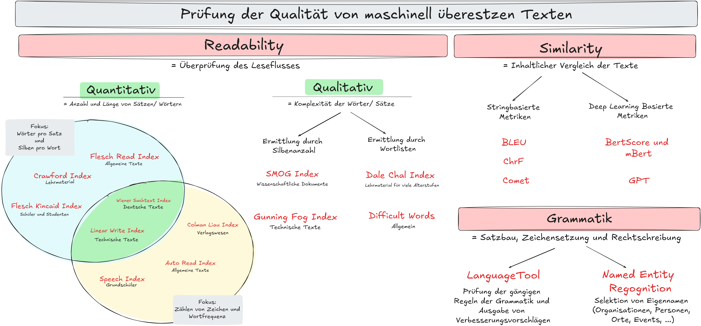
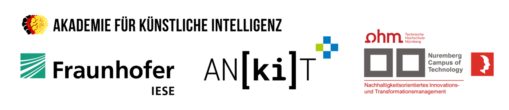

<a id="readme-top"></a>

<!-- PROJECT LOGO AND TITLE-->
<h1 align="center">
  <br>
  <a href="https://github.com/fmaag/MDZ_Usecase/tree/main"></a>
  <br>
  Evaluierung der Übersetzungsqualität
  <br>
</h1>
<h4 align="center">In Zusammenarbeit mit der <a href="https://www.nureg.de/" target="_blank">Nureg GmbH</a>.</h4>


<!-- LINKS -->
<p align="center">
  <a href="https://www.python.org/downloads/release/python-3100/"></a>
  <a href="https://jupyter.org/">
  
</a>


<!-- TABLE OF CONTENTS -->
<p align="center">
  <a href="#ziel-des-Projekts">Ziel</a> •
  <a href="#Environment-Varbiablen">Projektaufbau</a> •
  <a href="#Projektaufbau">Environment Variablen</a> •
  <a href="#erkenntnisse">Erkentnisse</a> •
  <a href="#contact">Contace</a> •
  <a href="#partner">Partner</a>
</p>


<br />

<!-- ZIEL DES PROJEKTS -->
<h1>Ziel des Projekts</h1>

Um eine verlässliche Bewertung zu gewährleisten, benötigen wir sowohl eine präzise Metrik, die eng mit menschlichen Urteilen korreliert, als auch eine Sammlung hochwertiger Referenzübersetzungen, um die Metrik zu validieren. Aus diesem Grund haben wir, das Mittelstand Digital Zentrum Franken, in Zusammenarbeit mit der Nureg GmbH aus Nürnberg, ein innovatives Digitalisierungsprojekt ins Leben gerufen. In diesem Projekt wurden verschiedene Metriken hinsichtlich ihrer Eignung zur Bewertung von Similarity und Readability untersucht. Die vielversprechendsten Metriken haben wir in dem Jupyter Notebook [Jupyter Notebook „Qualitätsprüfung“](https://github.com/Mittelstand-Digital-Zentrum-Franken/EvaluationOfTranslation/blob/main/Qualitaetspruefung.ipynb) zusammengefasst.


<br>
<p align="right">(<a href="#readme-top">back to top</a>)</p>

<!-- AUFBAU DES PROJEKTS -->
<h1>Aufbau des Projekts</h1>

### Inhalt

1. Stringbasierte Metriken
    1. [BLEU](https://github.com/Mittelstand-Digital-Zentrum-Franken/EvaluationOfTranslation/blob/main/Research/BLEU.ipynb)
    2. [ChrF](https://github.com/Mittelstand-Digital-Zentrum-Franken/EvaluationOfTranslation/blob/main/Research/ChrF.ipynb)

2. Deep Learning basierte Metriken
    1. [Bert Score](https://github.com/Mittelstand-Digital-Zentrum-Franken/EvaluationOfTranslation/blob/main/Research/BertScore.ipynb)
    2. [mBert](https://github.com/Mittelstand-Digital-Zentrum-Franken/EvaluationOfTranslation/blob/main/Research/mBert.ipynb)
    3. [Comet](https://github.com/Mittelstand-Digital-Zentrum-Franken/EvaluationOfTranslation/blob/main/Research/Comet.ipynb)

3. Sprachmodell als Evaluator
    1. [Textstat mit BERT Embedding](https://github.com/Mittelstand-Digital-Zentrum-Franken/EvaluationOfTranslation/blob/main/Research/Textstat.ipynb)
    2. [GPT](https://github.com/Mittelstand-Digital-Zentrum-Franken/EvaluationOfTranslation/blob/main/Research/GPT.ipynb)


<br>
<p align="right">(<a href="#readme-top">back to top</a>)</p>

<!-- ENVIRONMENT VARIABLEN -->
<h1>Environment Variablen</h1>
Um die Qualitätsprüfung mithilfe von GPT von OPEN AI durchführen zu können muss der Open AI Key in einer Environment Variable lokal gespeichert werden. Der Key wir dann über den Python Code aufgerufen. Zum festlegen der Envorionment Variable wird folgendes Vorgehen vorgeschlagen:

<br>

1. Drücken Sie die `Windows-Taste` und geben Sie "CMD" ein
2. Wählen Sie die `CMD als Administrator ausführen` aus
3. Festlgen der Environment Variable

    ```
    setx OPENAI_KEY "VALUE"
    ```
4. Überprüfen der Environment Variable
    ```
    echo $env:OPENAI_KEY
    ```
5. Aufrufen der Environment Variable in Python
    ```
    meine_variable = os.getenv('OPENAI_KEY')

    if meine_variable is not None:
        print(f'Der Wert von MEINE_VARIABLE ist: {meine_variable}')
    else:
        print('Die Umgebungsvariable MEINE_VARIABLE ist nicht gesetzt.')
    ```

<br>
<p align="right">(<a href="#readme-top">back to top</a>)</p>

<!-- ERKENNTNISSE -->
# Erkenntnisse

Im Zuge der explorativen Analyse zur Bewertung der Übersetzungsqualität haben wir uns auf drei verschiedene Methoden konzentriert: Similarity, Readability und die grammatikalische Prüfung.



### Similarity
Die [Similarity](https://ashukumar27.medium.com/similarity-functions-in-python-aa6dfe721035) gibt uns einen Anhaltspunkt dafür, wie stark zwei Texte oder Textabschnitte inhaltlich übereinstimmen. Diese Metrik ist besonders hilfreich, um zu sehen, ob Texte semantisch verwandt sind oder ob sie mehr oder weniger dasselbe ausdrücken. Dabei kommen verschiedene Algorithmen wie der Kosinus-Ähnlichkeitswert zum Einsatz, um diese Ähnlichkeit in Zahlen zu fassen.

### Readability
Die [Readability](https://readabilityformulas.com/how-to-decide-which-readability-formula-to-use/) oder Lesbarkeit zeigt uns, wie einfach ein Text zu lesen und zu verstehen ist. Faktoren wie Satzlänge, Wortlänge und die Komplexität des Wortschatzes spielen hier eine Rolle. Durch den Einsatz der [Textstat-Library](https://pypi.org/project/textstat/) konnten wir diese Lesbarkeits-Scores automatisch berechnen und vergleichen, was uns geholfen hat, die Verständlichkeit der Texte objektiv zu bewerten.

### Grammatikalische Prüfung
Für die grammatikalische Prüfung gibt es in Python mehrere nützliche Tools. Eines der bekanntesten ist [LanguageTool](https://pypi.org/project/language-tool-python/), das eine breite Palette von Grammatikfehlern, Stilproblemen und Rechtschreibfehlern erkennen kann. Zusätzlich bietet Gingerit eine einfache Möglichkeit zur Grammatik- und Rechtschreibprüfung.

### Named Entity Recognition
[SpaCy](https://spacy.io/) ist eine leistungsstarke Bibliothek für die Verarbeitung natürlicher Sprache in Python. Neben vielen anderen Funktionen bietet es auch die Named Entity Recognition (NER), mit der wir spezifische Entitäten wie Personen, Orte oder Organisationen in einem Text automatisch identifizieren und kategorisieren können. Diese Methode hilft uns dabei festzustellen, ob bestimmte Begriffe korrekt übersetzt wurden oder ob Übersetzungsfehler vorliegen, weil solche Entitäten nicht richtig erkannt wurden.


<br>
<p align="right">(<a href="#readme-top">back to top</a>)</p>

<!-- CONTACT -->
<h1>Contact</h1>

* <p align="left">
    
  Vernetzt euch gerne mit uns auf <a href="https://linkedin.com/in/mittelstand-digital-zentrum-franken">LinkedIn</a>
</p>

* <p align="left">
    
  Folgt uns gerne auf <a href="https://instagram.com/mittelstand_digital_franken">Instagram</a> um keine Neuigkeiten mehr zu verpassen
</p>

* <p align="left">
    
  Alle neuen Infos, Projekte, Kurse und Blogbeiträge findet ihr auf unserer <a href="https://digitalzentrum-franken.de/">Webside</a>
</p>

* <p align="left">
    
  Schreib uns eine Mail an <a href="mailto:info@digitalzentrum-franken.de">info@digitalzentrum-franken.de</a>
</p>

<br />
<p align="right">(<a href="#readme-top">back to top</a>)</p>


<!-- PARTNER -->
<h1>Partner</h1>



<br />
<p align="right">(<a href="#readme-top">back to top</a>)</p>
